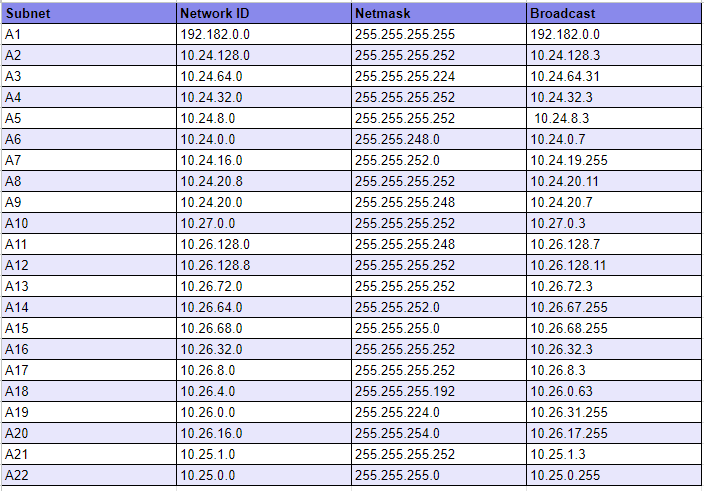

# Jarkom-Modul-4-E07-2023
Laporan Resmi Praktikum Modul 4 Jaringan Komputer 2023

## Author
| Nama | NRP |Github |
|---------------------------|------------|--------|
|Ihsan Widagdo | 5025211231 | https://github.com/dagdo03 |
|Sandyatama Fransisna Nugraha | 5025211196 | https://github.com/TamaFn |

## Daftar Isi
- [Topologi](#topologi)
  - [Topologi pada Cisco Packet Tracer](#topologi-pada-cisco-packet-tracer)
  - [Topologi pada GNS3](#topologi-pada-gns3)
  - [Pembagian Subnet](#pembagian-subnet)
- [VLSM](#vlsm)
  - [VLSM Tree](#vlsm-tree)
  - [Pembagian IP](#pembagian-ip)
  - [Testing](#testing)
- [CIDR](#cidr)
  - [Penggabungan IP](#penggabungan-ip)
  - [CIDR Tree](#cidr-tree)
  - [Pembagian IP](#pembagian-ip-2)
  - [Konfigurasi dan Routing](#konfigurasi-dan-routing)
  - [Testing](#testing-cidr)
- [Kendala](#kendala)

## Topologi
### Topologi pada Cisco Packet Tracer
### Topologi pada GNS3
Berikut adalah topologi jaringan pada GNS3.  


### Pembagian Subnet
Berikut adalah visualisasi pembagian subnet pada topologi jaringan.


## VLSM
### VLSM Tree


### Pembagian IP


### Konfigurasi dan Routing
Berikut adalah konfigurasi jaringan tiap node pada topologi.
- Aura
```bash
auto lo
iface lo inet loopback

auto eth0
iface eth0 inet dhcp

auto eth1
iface eth1 inet static
address 10.24.0.37
netmask 255.255.255.252

auto eth2
iface eth2 inet static
address 10.24.0.1
netmask 255.255.255.252

auto eth3
iface eth3 inet static
address 10.24.0.17
netmask 255.255.255.252
```
- Frieren
```bash
auto lo
iface lo inet loopback

auto eth0
iface eth0 inet static
address 10.24.0.2
netmask 255.255.255.252
gateway 10.24.0.1

auto eth1
iface eth1 inet static
address 10.24.0.65
netmask 255.255.255.224

auto eth2
iface eth2 inet static
address 10.24.0.5
netmask 255.255.255.252
```
- Flamme
```bash
auto lo
iface lo inet loopback

auto eth0
iface eth0 inet static
address 10.24.0.6
netmask 255.255.255.252
gateway 10.24.0.5

auto eth1
iface eth1 inet static
address 10.24.0.9
netmask 255.255.255.252

auto eth2
iface eth2 inet static
address 10.24.8.1
netmask 255.255.252.0

auto eth3
iface eth3 inet static
address 10.24.0.13
netmask 255.255.255.252
```
- Fern
```bash
auto lo
iface lo inet loopback

auto eth0
iface eth0 inet static
address 10.24.0.10
netmask 255.255.255.252
gateway 10.24.0.9

auto eth1
iface eth1 inet static
address 10.24.24.1
netmask 255.255.248.0
```
- Himmel
```bash
auto lo
iface lo inet loopback

auto eth0
iface eth0 inet static
address 10.24.0.14
netmask 255.255.255.252
gateway 10.24.0.13

auto eth1
iface eth1 inet static
address 10.24.0.41
netmask 255.255.255.248
```
- Denken
```bash
auto lo
iface lo inet loopback

auto eth0
iface eth0 inet static
address 10.24.0.38
netmask 255.255.255.252
gateway 10.24.0.37

auto eth1
iface eth1 inet static
address 10.24.2.1
netmask 255.255.255.0
```
- Eisen
```bash
auto lo
iface lo inet loopback

auto eth0
iface eth0 inet static
address 10.24.0.18
netmask 255.255.255.252
gateway 10.24.0.17

auto eth1
iface eth1 inet static
address 10.24.0.25
netmask 255.255.255.252

auto eth2
iface eth2 inet static
address 10.24.0.49
netmask 255.255.255.248

auto eth3
iface eth3 inet static
address 10.24.0.25
netmask 255.255.255.252

auto eth4
iface eth4 inet static
address 10.24.0.29
netmask 255.255.255.252
```
- Lugner
```bash
auto lo
iface lo inet loopback

auto eth0
iface eth0 inet static
address 10.24.0.26
netmask 255.255.255.252
gateway 10.24.0.25

auto eth1
iface eth1 inet static
address 10.24.1.1
netmask 255.255.255.0

auto eth2
iface eth2 inet static
address 10.24.12.1
netmask 255.255.252.0
```
- Linie
```bash
auto lo
iface lo inet loopback

auto eth0
iface eth0 inet static
address 10.24.0.30
netmask 255.255.255.252
gateway 10.24.0.29

auto eth1
iface eth1 inet static
address 10.24.0.33
netmask 255.255.255.252

auto eth2
iface eth2 inet static
address 10.24.4.1
netmask 255.255.240.0
```
- Lawine
```bash
auto lo
iface lo inet loopback

auto eth0
iface eth0 inet static
address 10.24.0.34
netmask 255.255.255.252
gateway 10.24.0.33

auto eth1
iface eth1 inet static
address 10.24.0.129
netmask 255.255.255.192
```
- Heiter
```bash
auto lo
iface lo inet loopback

auto eth0
iface eth0 inet static
address 10.24.0.130
netmask 255.255.255.192
gateway 10.24.0.129

auto eth1
iface eth1 inet static
address 10.24.16.1
netmask 255.255.252.0
```
- Stark
```bash
auto eth0
iface eth0 inet static
address 10.24.0.26
netmask 255.255.255.252
gateway 10.24.0.25
```
- Richter
```bash
auto eth0
iface eth0 inet static
address 10.24.0.51
netmask 255.255.255.248
gateway 10.24.0.49
```
- Revolte
```bash
auto eth0
iface eth0 inet static
address 10.24.0.50
netmask 255.255.255.248
gateway 10.24.0.49
```
- Sein
```bash
auto eth0
iface eth0 inet static
address 10.24.16.3
netmask 255.255.252.0
gateway 10.24.16.1
```
- LaubHills (397 host)
```bash
auto eth0
iface eth0 inet static
address 10.24.24.3
netmask 255.255.248.0
gateway 10.24.24.1
```
- AppetitRegion (625 host)
```bash
auto eth0
iface eth0 inet static
address 10.24.24.2
netmask 255.255.248.0
gateway 10.24.24.1
```
- LakeKorridor (24 host)
```bash
auto eth0
iface eth0 inet static
address 10.24.0.66
netmask 255.255.255.224
gateway 10.24.0.65
```
- RohrRoad (1000 host)
```bash
auto eth0
iface eth0 inet static
address 10.24.8.2
netmask 255.255.252.0
gateway 10.24.8.1
```
- RoyalCapital (63 host)
```bash
auto eth0
iface eth0 inet static
address 10.24.2.3
netmask 255.255.255.0
gateway 10.24.2.1
```
- WilleRegion (63 host)
```bash
auto eth0
iface eth0 inet static
address 10.24.2.2
netmask 255.255.255.0
gateway 10.24.2.1
```
- TurkRegion (1000 host)
```bash
auto eth0
iface eth0 inet static
address 10.24.12.2
netmask 255.255.252.0
gateway 10.24.12.1
```
- GrobeForest (250 host)
```bash
auto eth0
iface eth0 inet static
address 10.24.1.2
netmask 255.255.255.0
gateway 10.24.1.1
```
- GranzChannel (254 host)
```bash
auto eth0
iface eth0 inet static
address 10.24.4.2
netmask 255.255.240.0
gateway 10.24.4.1
```
- BredtRegion (29 host)
```bash
auto eth0
iface eth0 inet static
address 10.24.0.131
netmask 255.255.255.192
gateway 10.24.0.129
```
- RiegelCanyon (510 host)
```bash
auto eth0
iface eth0 inet static
address 10.24.16.2
netmask 255.255.252.0
gateway 10.24.16.1
```
Berikut adalah konfigurasi routing pada tiap node.
- Aura
```bash
#eth1
up route add -net 10.24.2.0 netmask 255.255.255.0 gw 10.24.0.38
#eth2
up route add -net 10.24.0.64 netmask 255.255.255.224 gw 10.24.0.2
up route add -net 10.24.0.4 netmask 255.255.255.252 gw 10.24.0.2
up route add -net 10.24.0.8 netmask 255.255.255.252 gw 10.24.0.2
up route add -net 10.24.24.0 netmask 255.255.248.0 gw 10.24.0.2
up route add -net 10.24.8.0 netmask 255.255.252.0 gw 10.24.0.2
up route add -net 10.24.0.40 netmask 255.255.255.248 gw 10.24.0.2
#eth3
up route add -net 10.24.0.48 netmask 255.255.255.248 gw 10.24.0.18
up route add -net 10.24.0.40 netmask 255.255.255.248 gw 10.24.0.18
up route add -net 10.24.0.24 netmask 255.255.255.252 gw 10.24.0.18
up route add -net 10.24.1.0 netmask 255.255.255.0 gw 10.24.0.18
up route add -net 10.24.12.0 netmask 255.255.252.0 gw 10.24.0.18
up route add -net 10.24.0.128 netmask 255.255.255.192 gw 10.24.0.18
up route add -net 10.24.16.0 netmask 255.255.255.252 gw 10.24.0.18
up route add -net 10.24.0.20 netmask 255.255.255.252 gw 10.24.0.18
up route add -net 10.24.0.28 netmask 255.255.255.252 gw 10.24.0.18
up route add -net 10.24.4.0 netmask 255.255.240.0 gw 10.24.0.18
```
- Frieren
```bash
# bind everywhere
up route add -net 10.24.0.8 netmask 255.255.255.252 gw 10.24.0.6
up route add -net 10.24.24.0 netmask 255.255.248.0 gw 10.24.0.6
up route add -net 10.24.0.12 netmask 255.255.255.252 gw 10.24.0.6
up route add -net 10.24.0.40 netmask 255.255.255.248 gw 10.24.0.6
up route add -net 10.24.8.0 netmask 255.255.252.0 gw 10.24.0.6
up route add -net 10.24.0.40 netmask 255.255.255.248 gw 10.24.0.6
```
- Flamme
```bash
# bind everyhere
up route add -net 10.24.24.0 netmask 255.255.248.0 gw 10.24.0.10
up route add -net 10.24.0.40 netmask 255.255.255.248 gw 10.24.0.14
```
- Eisen
```bash
# bind everywhere
#eth3
up route add -net 10.24.12.0 netmask 255.255.252.0 gw 10.24.0.26
up route add -net 10.24.1.0 netmask 255.255.255.0 gw 10.24.0.26

#eth4
up route add -net 10.24.4.0 netmask 255.255.240.0 gw 10.24.0.30
up route add -net 10.24.0.32 netmask 255.255.255.252 gw 10.24.0.30
up route add -net 10.24.16.0 netmask 255.255.255.252 gw 10.24.0.30
up route add -net 10.24.0.128 netmask 255.255.255.192 gw 10.24.0.30
```
- Linie
```bash
#eth1
up route add -net 10.24.16.0 netmask 255.255.255.252 gw 10.24.0.34
up route add -net 10.24.0.128 netmask 255.255.255.192 gw 10.24.0.34
```
- Lawine
```bash
# bind everywhere
up route add -net 10.24.16.0 netmask 255.255.252.0 gw 10.24.0.130
```
## Testing


## CIDR
Classless Inter-Domain Routing (CIDR) adalah metode pengalamatan IP yang memungkinkan alokasi alamat yang lebih efisien dengan menggunakan panjang prefix untuk menentukan panjang subnet. 

### Penggabungan IP
Berikut adalah langkah-langkah penggabungan IP subnet yang telah kami tentukan sebelumnya.

#### Kondisi Semula (Subnet A)

    
  


#### Penggabungan 1 (Subnet B)

    
  

#### Penggabungan 2 (Subnet C)

    
   

#### Penggabungan 3 (Subnet D)

    
  

#### Penggabungan 4 (Subnet E)

    
    

#### Penggabungan 5 (Subnet F)

    
   

#### Penggabungan 6 (Subnet G)

    
  

#### Penggabungan 6 (Subnet H)

    
  

#### Penggabungan 6 (Subnet I)

    
  

#### Penggabungan 6 (Subnet J)

    
  

#### Penggabungan 6 (Subnet K)

    
  

### CIDR Tree
Berikut adalah visualisasi IP tree berdasarkan penggabungan subnet yang telah dilakukan sebelumnya.
  

### Pembagian IP
Berikut adalah tabel hasil dari pembagian IP berdasarkan tree di atas.



## Kendala
- Kurangnya informasi terkait implementasi CIDR pada topologi GNS3 di modul praktikum membuat sedikit bingung saat melakukan konfigurasi node.
- Terkadang terjadi kendala eror ketika melakukan ping pada gns (awalnya bisa tiba tiba tidak bisa)