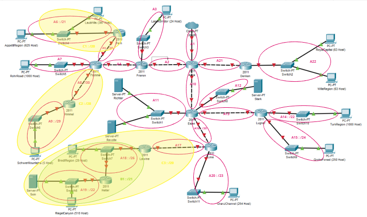

# Jarkom-Modul-4-E07-2023
Laporan Resmi Praktikum Modul 4 Jaringan Komputer 2023

## Author
| Nama | NRP |Github |
|---------------------------|------------|--------|
|Ihsan Widagdo | 5025211231 | https://github.com/dagdo03 |
|Sandyatama Fransisna Nugraha | 5025211196 | https://github.com/TamaFn |

## Daftar Isi
- [Topologi](#topologi)
  - [Topologi pada Cisco Packet Tracer](#topologi-pada-cisco-packet-tracer)
  - [Topologi pada GNS3](#topologi-pada-gns3)
  - [Pembagian Subnet](#pembagian-subnet)
- [VLSM](#vlsm)
  - [VLSM Tree](#vlsm-tree)
  - [Pembagian IP](#pembagian-ip)
  - [Testing](#testing)
- [CIDR](#cidr)
  - [Penggabungan IP](#penggabungan-ip)
  - [CIDR Tree](#cidr-tree)
  - [Pembagian IP](#pembagian-ip-2)
  - [Konfigurasi dan Routing](#konfigurasi-dan-routing)
  - [Testing](#testing-cidr)
- [Kendala](#kendala)

## Topologi
### Topologi pada Cisco Packet Tracer
### Topologi pada GNS3
Berikut adalah topologi jaringan pada GNS3.  


### Pembagian Subnet
Berikut adalah visualisasi pembagian subnet pada topologi jaringan.


## VLSM
### VLSM Tree


### Pembagian IP


### Konfigurasi dan Routing
Berikut adalah konfigurasi jaringan tiap node pada topologi.
- Aura
```bash
auto eth0
iface eth0 inet dhcp

auto eth1
iface eth1 inet static
	address 10.40.65.1
	netmask 255.255.255.252

auto eth2
iface eth2 inet static
	address 10.40.66.34
	netmask 255.255.255.252

auto eth3
iface eth3 inet static
	address 10.40.192.9
	netmask 255.255.255.252
```
- Frieren
```bash
auto eth0
iface eth0 inet static
	address 10.40.66.33
	netmask 255.255.255.252

auto eth1
iface eth1 inet static
	address 10.40.16.2
	netmask 255.255.255.252

auto eth2
iface eth2 inet static
	address 10.40.66.1
	netmask 255.255.255.224
```
- Flamme
```bash
auto eth0
iface eth0 inet static
	address 10.40.16.1
	netmask 255.255.255.252

auto eth1
iface eth1 inet static
	address 10.40.8.2
	netmask 255.255.255.252

auto eth2
iface eth2 inet static
	address 10.40.36.9
	netmask 255.255.255.252

auto eth3
iface eth3 inet static
	address 10.40.32.1
	netmask 255.255.252.0
```
- Fern
```bash
auto eth0
iface eth0 inet static
	address 10.40.8.1
	netmask 255.255.255.252

auto eth1
iface eth1 inet static
	address 10.40.0.1
	netmask 255.255.248.0
```
- Himmel
```bash
auto eth0
iface eth0 inet static
	address 10.40.36.10
	netmask 255.255.255.252

auto eth1
iface eth1 inet static
	address 10.40.36.1
	netmask 255.255.255.248
```
- Denken
```bash
auto eth0
iface eth0 inet static
	address 10.40.65.2
	netmask 255.255.255.252

auto eth1
iface eth1 inet static
	address 10.40.64.1
	netmask 255.255.255.0
```
- Eisen
```bash
auto eth0
iface eth0 inet static
	address 10.40.192.10
	netmask 255.255.255.252

auto eth1
iface eth1 inet static
	address 10.40.146.1
	netmask 255.255.255.252

auto eth2
iface eth2 inet static
	address 10.40.168.1
	netmask 255.255.255.252

auto eth3
iface eth3 inet static
	address 10.40.176.1
	netmask 255.255.255.252

auto eth4
iface eth4 inet static
	address 10.40.192.1
	netmask 255.255.255.248
```
- Lugner
```bash
auto eth0
iface eth0 inet static
	address 10.40.168.2
	netmask 255.255.255.252

auto eth1
iface eth1 inet static
	address 10.40.160.1
	netmask 255.255.252.0

auto eth2
iface eth2 inet static
	address 10.40.164.1
	netmask 255.255.255.0
```
- Linie
```bash
auto eth0
iface eth0 inet static
	address 10.40.146.2
	netmask 255.255.255.252

auto eth1
iface eth1 inet static
	address 10.40.136.1
	netmask 255.255.252.0

auto eth2
iface eth2 inet static
	address 10.40.144.1
	netmask 255.255.254.0
```
- Lawine
```bash
auto eth0
iface eth0 inet static
	address 10.40.136.2
	netmask 255.255.255.252

auto eth1
iface eth1 inet static
	address 10.40.132.1
	netmask 255.255.255.192
```
- Heiter
```bash
auto eth0
iface eth0 inet static
	address 10.40.132.2
	netmask 255.255.255.192

auto eth1
iface eth1 inet static
	address 10.40.128.1
	netmask 255.255.252.0
```
- Stark
```bash
auto eth0
iface eth0 inet static
	address 10.40.176.2
	netmask 255.255.255.252
	gateway 10.40.176.1
```
- Richter
```bash
auto eth0
iface eth0 inet static
	address 10.40.192.2
	netmask 255.255.255.248
	gateway 10.40.192.1
```
- Revolte
```bash
auto eth0
iface eth0 inet static
	address 10.40.192.3
	netmask 255.255.255.248
	gateway 10.40.192.1
```
- Sein
```bash
auto eth0
iface eth0 inet static
	address 10.40.128.2
	netmask 255.255.252.0
	gateway 10.40.128.1
```
- LaubHills (397 host)
```bash
auto eth0
iface eth0 inet static
	address 10.40.0.2
	netmask 255.255.248.0
	gateway 10.40.0.1
```
- AppetitRegion (625 host)
```bash
auto eth0
iface eth0 inet static
	address 10.40.3.0
	netmask 255.255.248.0
	gateway 10.40.0.1
```
- LakeKorridor (24 host)
```bash
auto eth0
iface eth0 inet static
	address 10.40.66.3
	netmask 255.255.255.224
	gateway 10.40.66.1
```
- RohrRoad (1000 host)
```bash
auto eth0
iface eth0 inet static
	address 10.40.32.2
	netmask 255.255.252.0
	gateway 10.40.32.1
```
- RoyalCapital (63 host)
```bash
auto eth0
iface eth0 inet static
	address 10.40.64.64
	netmask 255.255.255.0
	gateway 10.40.64.1
```
- WilleRegion (63 host)
```bash
auto eth0
iface eth0 inet static
	address 10.40.64.65
	netmask 255.255.255.0
	gateway 10.40.64.1
```
- TurkRegion (1000 host)
```bash
auto eth0
iface eth0 inet static
	address 10.40.160.2
	netmask 255.255.252.0
	gateway 10.40.160.1
```
- GrobeForest (250 host)
```bash
auto eth0
iface eth0 inet static
	address 10.40.164.2
	netmask 255.255.252.0
	gateway 10.40.164.1
```
- GranzChannel (254 host)
```bash
auto eth0
iface eth0 inet static
	address 10.40.144.2
	netmask 255.255.254.0
	gateway 10.40.144.1
```
- BredtRegion (29 host)
```bash
auto eth0
iface eth0 inet static
	address 10.40.132.3
	netmask 255.255.255.192
	gateway 10.40.132.1
```
- RiegelCanyon (510 host)
```bash
auto eth0
iface eth0 inet static
	address 10.40.128.3
	netmask 255.255.252.0
	gateway 10.40.128.1
```
Berikut adalah konfigurasi routing pada tiap node.
- Aura
```bash
# kiri (frieren)
route add -net 10.40.0.0 netmask 255.255.248.0 gw 10.40.66.33 # subnet A1
route add -net 10.40.8.0 netmask 255.255.255.252 gw 10.40.66.33 # subnet A2
route add -net 10.40.32.0 netmask 255.255.252.0 gw 10.40.66.33 # subnet A3
route add -net 10.40.36.8 netmask 255.255.255.252 gw 10.40.66.33 # subnet A4
route add -net 10.40.36.0 netmask 255.255.255.248 gw 10.40.66.33 # subnet A5
route add -net 10.40.16.0 netmask 255.255.255.252 gw 10.40.66.33 # subnet A6
route add -net 10.40.66.0 netmask 255.255.255.224 gw 10.40.66.33 # subnet A7

# kanan (denken)
route add -net 10.40.64.0 netmask 255.255.255.0 gw 10.40.65.2 # subnet A10

# bawah (eisen)
route add -net 10.40.176.0 netmask 255.255.255.252 gw 10.40.192.10 # subnet A12
route add -net 10.40.192.0 netmask 255.255.255.248 gw 10.40.192.10 # subnet A13
route add -net 10.40.168.0 netmask 255.255.255.252 gw 10.40.192.10 # subnet A14
route add -net 10.40.160.0 netmask 255.255.252.0 gw 10.40.192.10 # subnet A15
route add -net 10.40.164.0 netmask 255.255.255.0 gw 10.40.192.10 # subnet A16
route add -net 10.40.146.0 netmask 255.255.255.252 gw 10.40.192.10 # subnet A17
route add -net 10.40.136.0 netmask 255.255.255.252 gw 10.40.192.10 # subnet A18
route add -net 10.40.132.0 netmask 255.255.255.192 gw 10.40.192.10 # subnet A19
route add -net 10.40.128.0 netmask 255.255.252.0 gw 10.40.192.10 # subnet A20
route add -net 10.40.144.0 netmask 255.255.254.0 gw 10.40.192.10 # subnet A21
```
- Frieren
```bash
# bind everywhere
route add -net 0.0.0.0 netmask 0.0.0.0 gw 10.40.66.34

route add -net 10.40.0.0 netmask 255.255.248.0 gw 10.40.16.1 # subnet A1
route add -net 10.40.8.0 netmask 255.255.255.252 gw 10.40.16.1 # subnet A2
route add -net 10.40.32.0 netmask 255.255.252.0 gw 10.40.16.1 # subnet A3
route add -net 10.40.36.8 netmask 255.255.255.252 gw 10.40.16.1 # subnet A4
route add -net 10.40.36.0 netmask 255.255.255.248 gw 10.40.16.1 # subnet A5
```
- Flamme
```bash
# bind everyhere
route add -net 0.0.0.0 netmask 0.0.0.0 gw 10.40.16.2

route add -net 10.40.0.0  netmask 255.255.248.0 gw 10.40.8.1 # subnet A1
route add -net 10.40.36.0 netmask 255.255.255.248 gw 10.40.36.10 # subnet A5
```
- Fern
```bash
# bind everywhere
route add -net 0.0.0.0 netmask 0.0.0.0 gw 10.40.8.2
```
- Himmel
```bash
# bind everywhere
route add -net 0.0.0.0 netmask 0.0.0.0 gw 10.40.36.9
```
- Denken
```bash
# bind everywhere
route add -net 0.0.0.0 netmask 0.0.0.0 gw 10.40.65.1
```
- Eisen
```bash
# bind everywhere
route add -net 0.0.0.0 netmask 0.0.0.0 gw 10.40.192.9

route add -net 10.40.160.0 netmask 255.255.252.0 gw 10.40.168.2 # subnet A15
route add -net 10.40.164.0 netmask 255.255.255.0 gw 10.40.168.2 # subnet A16
route add -net 10.40.136.0 netmask 255.255.255.252 gw 10.40.146.2 # subnet A18
route add -net 10.40.132.0 netmask 255.255.255.192 gw 10.40.146.2 # subnet A19
route add -net 10.40.128.0 netmask 255.255.252.0 gw 10.40.146.2 # subnet A20
route add -net 10.40.144.0 netmask 255.255.254.0 gw 10.40.146.2 # subnet A21
```
- Lugner
```bash
# bind everywhere
route add -net 0.0.0.0 netmask 0.0.0.0 gw 10.40.168.1
```
- Linie
```bash
# bind everywhere
route add -net 0.0.0.0 netmask 0.0.0.0 gw 10.40.146.1

route add -net 10.40.132.0 netmask 255.255.255.192 gw 10.40.136.2 # subnet A19
route add -net 10.40.128.0 netmask 255.255.252.0 gw 10.40.136.2 # subnet A20
```
- Lawine
```bash
# bind everywhere
route add -net 0.0.0.0 netmask 0.0.0.0 gw 10.40.136.1

route add -net 10.40.128.0 netmask 255.255.252.0 gw 10.40.132.2 # subnet A20
```
- Heiter
```bash
# bind everywhere
route add -net 0.0.0.0 netmask 0.0.0.0 gw 10.40.132.1
```

### Testing
Setelah melakukan routing, kita dapat mengecek apakah konfigurasi route sudah benar dengan memasukkan perintah sebagai berikut pada terminal.
```
route -n
```
Berikut adalah konfigurasi routing pada node Frieren.
```bash
route add -net 0.0.0.0 netmask 0.0.0.0 gw 10.40.66.34 # bind everywhere
route add -net 10.40.0.0 netmask 255.255.248.0 gw 10.40.16.1 # subnet A1
route add -net 10.40.8.0 netmask 255.255.255.252 gw 10.40.16.1 # subnet A2
route add -net 10.40.32.0 netmask 255.255.252.0 gw 10.40.16.1 # subnet A3
route add -net 10.40.36.8 netmask 255.255.255.252 gw 10.40.16.1 # subnet A4
route add -net 10.40.36.0 netmask 255.255.255.248 gw 10.40.16.1 # subnet A5
```
Setelah dilakukan pengecekan dengan perintah `route -n`, maka akan terlihat sebagai berikut.
  
Selain itu, kita dapat mengetes apakah routing telah sukses dengan melakukan PING dari node ke node. Misalkan, kita melakukan PING dari client AppetitRegion menuju server Sein.
  
Kita dapat melakukan command berikut pada terminal AppetitRegion untuk meng-PING Sein. (`10.40.128.2` merupakan alamat IP dari Sein)
```
ping 10.40.128.2
```
Berikut adalah tampilan terminal ketika berhasil melakukan PING.


## CIDR
Classless Inter-Domain Routing (CIDR) adalah metode pengalamatan IP yang memungkinkan alokasi alamat yang lebih efisien dengan menggunakan panjang prefix untuk menentukan panjang subnet. 

### Penggabungan IP
Berikut adalah langkah-langkah penggabungan IP subnet yang telah kami tentukan sebelumnya.

#### Kondisi Semula (Subnet A)

    
  


#### Penggabungan 1 (Subnet B)

    
  

#### Penggabungan 2 (Subnet C)

    
   

#### Penggabungan 3 (Subnet D)

    
  

#### Penggabungan 4 (Subnet E)

    
    

#### Penggabungan 5 (Subnet F)

    
   

#### Penggabungan 6 (Subnet G)

    
  

#### Penggabungan 6 (Subnet H)

    
  

#### Penggabungan 6 (Subnet I)

    
  

#### Penggabungan 6 (Subnet J)

    
  

#### Penggabungan 6 (Subnet K)

    
  

### CIDR Tree
Berikut adalah visualisasi IP tree berdasarkan penggabungan subnet yang telah dilakukan sebelumnya.
  

### Pembagian IP
Berikut adalah tabel hasil dari pembagian IP berdasarkan tree di atas.


## Kendala
- Kurangnya informasi terkait implementasi CIDR pada topologi GNS3 di modul praktikum membuat sedikit bingung saat melakukan konfigurasi node.
- Terkadang terjadi anomali saat melakukan PING pada node tertentu di GNS3, namun ketika projek dibuka ulang PING kembali normal.